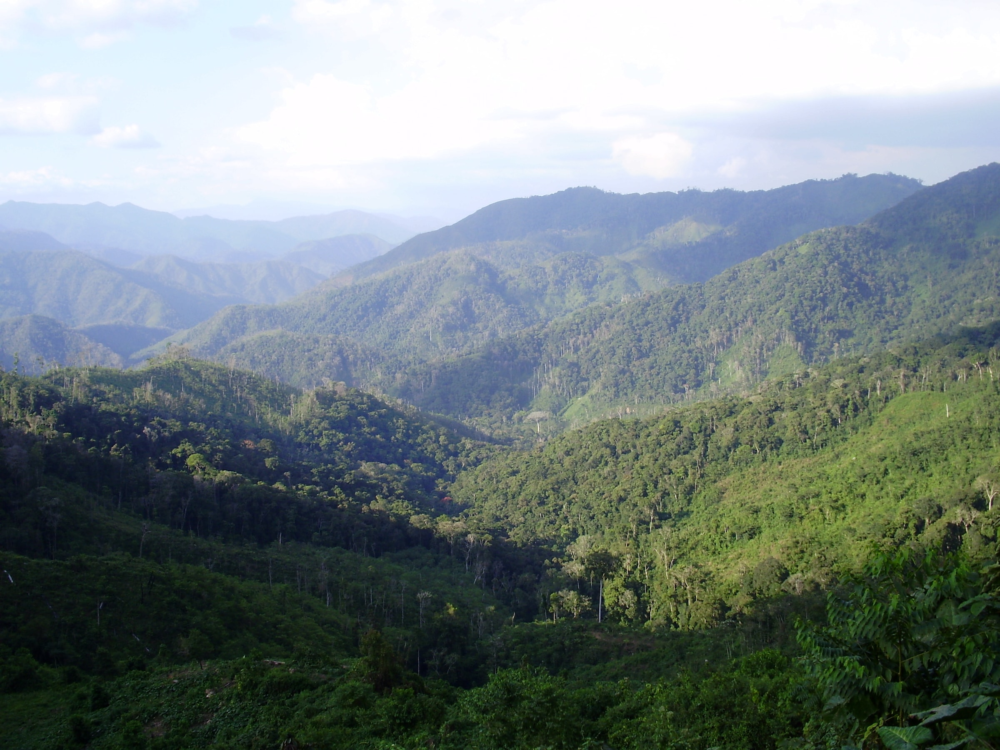

Los bosques siempreverdes <i>per se</i> integran la formación vegetal cuyo nombre genérico es “bosques siempreverdes”, caracterizados por una sustitución paulatina de la masa foliar a lo largo del año. Los árboles dominantes nunca se presentan desprovistos de hojas y menos de 25% de los individuos pierde su follaje durante la estación de sequía. Los bosques siempreverdes <i>per se</i> están distribuidos desde tierras bajas, principalmente al sur del territorio nacional, hasta zonas montañosas, donde pueden alcanzar 2.000 metros de altitud, específicamente en la cordillera de los Andes y la Guayana venezolana (Fotos 1 y 2). Desde el punto de vista del régimen térmico, abarcan una diversidad de ambientes: desde macrotérmicos (en tierras bajas), con una temperatura media anual superior a 24°C, hasta los mesotérmicos (en zonas montañosas), donde la temperatura media anual puede descender hasta 12°C. Los bosques siempreverdes <i>per se</i> están casi exclusivamente asociados a climas húmedos, con precipitaciones medias anuales por encima de 1.400 mm y exceso de agua casi todo el año, proveniente de lluvia o por saturación del suelo (Huber & Alarcón 1988). En general, tienden a presentar precipitaciones promedio superiores a 1.800 mm, alcanzando incluso 4.000 mm al sur del estado Bolívar, según los datos del MARN-Hidrología (2004). Entre los siempreverdes <i>per se</i> también se incluyen los bosques subsiempreverdes o semisiempreverdes, asociados a áreas de menor disponibilidad de agua.  

# sfsdfsdf

## dfsdfsdfd

### sdfsdfdf

* dsfsdf
* test [something](sdfsdf)
- punto
- docs

<ul>
  <li>epa</li>
  <li>Vale</li>
</ul>

Los *bosques* siempreverdes <i>per se</i> están conformados por tipos más específicos de formaciones vegetales, dependiendo de su posición orográfica, climática y de las características anatómicas de las especies que le conforman. Entre ellos se encuentran los bosques macrotérmicos siempreverdes de tierras bajas, los bosques húmedos siempreverdes basimontanos, submontanos y montanos siempre verdes y los bosques húmedos esclerófilos siempreverdes, entre otros (Huber & Alarcón 1988, Huber 1995a).
